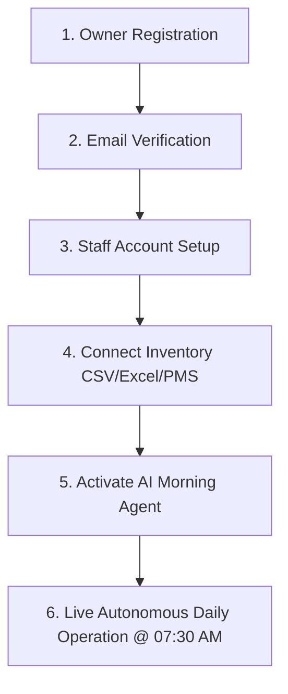

# PharmaGuard AI — Real Pharmacy Owner Onboarding Guide

**Product Identity:** Autonomous Pharmacy Intelligence Employee  
**Target User:** Pharmacy Owners, Managing Directors, Head Pharmacists  
**Version:** 1.0.0 (Production Live)

---

## 1. Quick Onboarding Overview (Zero-Developer Intervention)

PharmaGuard AI is designed for seamless, self-service onboarding in under 10 minutes:

---

## 2. Step-by-Step Walkthrough

### Step 1: Owner & Pharmacy Registration
1. Navigate to the registration portal at `https://app.pharmaguard.ai/register`.
2. Fill in:
   - **Organization Legal Name:** (e.g., *Pharmacie de l'Avenir*)
   - **National Health License Number:** (e.g., *LIC-DLA-2026-0042*)
   - **Location / City:** (e.g., *Douala, Littoral*)
   - **Owner Full Name:** (e.g., *Dr. Henriette Belibi*)
   - **Official Email & Password**
3. Click **Create Pharmacy Account**.

### Step 2: Email Verification
1. Check your email inbox for the verification link.
2. Click **Verify Email** (or submit the verification token to `/api/v1/auth/verify-email`).
3. Your account is now active with **`OWNER`** super-administrative permissions.

### Step 3: Add Staff & Assign RBAC Roles
1. Go to **Settings $\to$ Staff Management**.
2. Invite your pharmacy team members with their respective roles:
   - **`PHARMACIST`:** Can review, modify, and authorize financial purchase orders staged by the AI. Receives WhatsApp intelligence reports.
   - **`ASSISTANT`:** Can scan incoming delivery barcodes and check shelf locations. (Cannot approve financial orders).
   - **`AUDITOR`:** Read-only access to regulatory logs and inventory health metrics.

### Step 4: Connect Inventory Data
PharmaGuard AI supports 3 methods of connecting your catalog:
- **Option A — CSV / Excel Upload:** Drag and drop your inventory export from your current POS software. PharmaGuard AI automatically recognizes French and English column headers (`code_cip`, `designation`, `quantite`, `prix_achat`, `peremption`).
- **Option B — Direct PMS Integration:** Enter your pharmacy software API webhook key.
- **Option C — Barcode Scanner Ingestion:** Scan your shelf barcodes using the PharmaGuard mobile barcode reader.

### Step 5: Configure Schedule & Activate Agent
1. Choose your preferred morning intelligence briefing time (Default: **`07:30 AM`**).
2. Enter the WhatsApp phone number of the Chief Pharmacist to receive daily summaries.
3. Click **Activate PharmaGuard AI**.
4. The AI immediately runs a baseline calibration and stages the day's Action Center queue.

---

## 3. Daily Operations (What to Expect Every Morning)

1. **07:30 AM:** PharmaGuard AI wakes up, evaluates all stock coverage against supplier delivery times, checks batch expiration horizons, and predicts stockout dates.
2. **07:35 AM:** Chief Pharmacist receives an executive briefing on WhatsApp and in the Pharmacist Command Center.
3. **08:00 AM:** Pharmacist reviews staged `DRAFT` purchase orders, makes any adjustments, and clicks **Approve**.
4. **Instant Dispatch:** Orders are automatically emailed to Laborex, Ubipharm, or your primary wholesale distributors.
