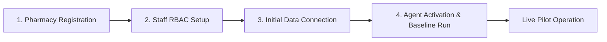

# PharmaGuard AI — Real Pharmacy Pilot Deployment & Operations Guide

**Product Identity:** Autonomous Pharmacy Intelligence Employee  
**Target Environment:** Community, Hospital, and Multi-Branch Retail Pharmacies  
**Platform Version:** 1.0.0 (Production Pilot Ready)

---

## 1. Pharmacy Onboarding Guide

The onboarding process is structured into 4 deterministic, verifiable steps:



### Step 1: Pharmacy Registration & Regulatory Verification
- **API Endpoint:** `POST /api/v1/onboarding/register`
- **Required Information:**
  - `organization_name`: Legal trade name of the pharmacy (e.g., "Pharmacie du Centre").
  - `license_number`: National Ministry of Public Health / Pharmacy Board registration number.
  - `location`: Operational city / region (e.g., "Douala", "Yaoundé", "Bafoussam") — used for regional epidemiological calibration.
  - `contact_email`: Official administrative email address.
  - `pilot_tier`: `STANDARD_PILOT` or `ENTERPRISE_PILOT`.

### Step 2: Staff Account Setup & Role Assignment
- **API Endpoint:** `POST /api/v1/onboarding/staff`
- **Supported Roles & Permissions:**
  | Role | Responsibilities & Access Permissions |
  | :--- | :--- |
  | **`OWNER`** | Full administrative rights, pilot analytics, multi-pharmacy regional supply metrics, billing & license controls. |
  | **`PHARMACIST`** | Reviewing and approving AI purchase orders, modifying quantities/suppliers, setting custom safety buffers, receiving WhatsApp intelligence briefings. |
  | **`ASSISTANT`** | Read-only inventory browsing, barcode dispensing and receiving, physical stock counting. *(Cannot approve financial purchase orders)* |
  | **`AUDITOR`** | Read-only access to regulatory logs, agent evaluation scorecards, and audit trails. |

### Step 3: Data Connection Setup
- **API Endpoint:** `POST /api/v1/onboarding/connect-data`
- Ingests initial inventory, price books, and supplier mappings via CSV/Excel or direct POS connector.
- Computes immediate **Data Quality Score (DQS)**:
  $$\text{DQS} = (0.40 \times \text{Cost Completeness}) + (0.40 \times \text{Expiry Completeness}) + (0.20 \times \text{Batch Completeness})$$
- Requires $\text{DQS} \ge 70\%$ to proceed to activation.

### Step 4: Autonomous Agent Activation
- **API Endpoint:** `POST /api/v1/onboarding/activate`
- Sets the pharmacy's preferred morning execution schedule (e.g., `07:30 AM`).
- Runs the initial baseline autonomous cycle (`multi_agent_orchestrator.execute_morning_cycle`).
- Generates the day 1 baseline operational intelligence report and primes the Action Center queue.

---

## 2. Data Requirements & Integration Specifications

PharmaGuard AI integrates with existing pharmacy management systems (PMS / ERP) via batch file ingestions (CSV/Excel) or real-time REST API / Barcode webhooks.

### Required Data Schema

#### A. Inventory Dataset (`inventory.csv`)
| Field Name | Type | Mandatory? | Description & Validation |
| :--- | :--- | :--- | :--- |
| `medicine_id` or `sku` | String | **Yes** | Unique identifier or national barcode (EAN-13 / GTIN). |
| `medicine_name` | String | **Yes** | Commercial or generic brand name (e.g., "Coartem 20/120mg"). |
| `current_stock` | Integer | **Yes** | Current saleable on-hand physical stock quantity ($\ge 0$). |
| `reorder_level` | Integer | Optional | Minimum safety stock threshold (Default: dynamic AI safety stock). |
| `unit_cost_fcfa` | Float | **Yes** | Acquisition price per unit from primary distributor. |
| `expiry_date` | Date (YYYY-MM-DD) | **Yes** | Expiration date of active batch for FEFO tracking. |
| `batch_number` | String | Recommended | Manufacturer batch/lot identifier for recall traceability. |
| `supplier_id` | String | Recommended | Primary distributor identifier (e.g., "LABOREX", "UBIPHARM"). |

#### B. Historical Sales Dataset (`sales.csv`)
- **Required Columns:** `date`, `medicine_id`, `quantity_sold`.
- **Minimum History:** 14 consecutive days for baseline forecasting; 90 days recommended for seasonal trend calibration.

---

## 3. Operational Workflow (Day-in-the-Life of a Pilot Pharmacy)

```
  07:30 AM — Autonomous Ingestion & Reasoning
  │
  ├── 1. Inventory Agent: Evaluates physical stock coverage & FEFO expiry risks.
  ├── 2. Forecasting Agent: Applies seasonal coefficients, predicts stockout dates.
  ├── 3. Procurement Agent: Ranks verified suppliers, optimizes reorder quantities.
  └── 4. Multi-Agent Orchestrator: Synthesizes Morning Intelligence Briefing.
  │
  07:35 AM — Dispatch to Human-in-the-Loop
  │
  ├── Action Center Queue: Staged DRAFT Purchase Orders & Prioritized Alerts.
  └── WhatsApp Executive Summary: Delivered to Chief Pharmacist's phone.
  │
  08:00 AM — Pharmacist Evaluation & One-Click Decision
  │
  ├── Decision A: Approve as-is -> Order dispatched via Email/WhatsApp to Supplier.
  ├── Decision B: Modify quantity / supplier -> Dispatched + Memory learned.
  └── Decision C: Reject with rationale -> Cancelled + Preference updated.
  │
  14:00 PM - 18:00 PM — Barcode Ingestion & Stock Reconciliation
  │
  └── Inbound deliveries scanned via Barcode Receiver (`/api/v1/inventory/barcode/receive`).
```

---

## 4. Clinical & Operational Safety Checklist

Before placing PharmaGuard AI into live production pilot status, verify that all safety controls are active:

- [x] **Strict Clinical Boundaries Enforced:**
  - The AI **never** diagnoses patients.
  - The AI **never** alters patient prescriptions or replaces pharmacist therapeutic checks.
  - System is strictly an *operational inventory and supply chain intelligence employee*.
- [x] **Mandatory Human-in-the-Loop (HITL) for Financial Commitments:**
  - AI recommendations are strictly staged in `DRAFT` status.
  - No purchase order can be dispatched without explicit pharmacist or owner signature/token approval.
- [x] **Tenant Data Isolation:**
  - Multi-tenant architecture guarantees strict database isolation between independent pharmacy organizations.
- [x] **Cold-Chain & High-Alert Drug Rules:**
  - Critical refrigerated items (e.g., Insulin, Vaccines) enforce strict 2°C–8°C storage warnings and emergency lead time buffers.
- [x] **Auditability & Traceability:**
  - Every decision, approval, modification, and supplier communication is timestamped and recorded in `agent_action_logs` and `agent_memories`.
- [x] **Automated Scenario Validation Passed:**
  - Verified against 4 real-world test scenarios: Stock Shortage, Supplier Delays, Seasonal Surges, and Human Feedback Learning.
